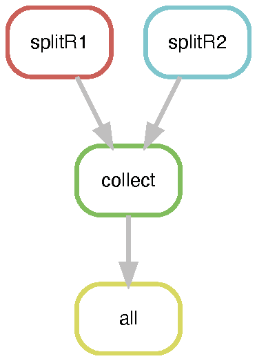
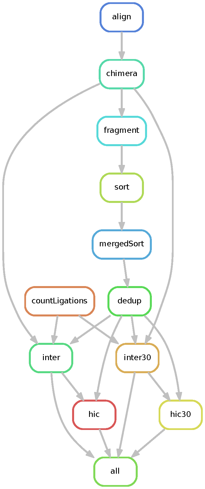
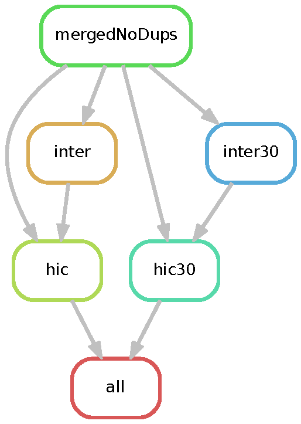

# dietJuicer

Like `juicer`, but without all those calories

`dietJuicer` is a lighter-weight, HPC flexible version of juicer written with snakemake.


## Quickstart - dietJuicerCore
-----------------------------------

`dietJuicerCore` is designed to be run on a single Hi-C library. Sequencing replicates (i.e. the same Hi-C library split to maximize complexity), can combined and run together. Run the following processing steps for each Hi-C library:

1. Clone workflow into working directory:

    ```bash
    git clone https://github.com/EricSDavis/dietJuicer.git .
    ```

2. Edit the tab-separated `samplesheet.txt` file with the names of `Read1` and `Read2` gzipped fastq files and the path to these files under the `Sequencing_Directory` column. No naming convention is needed for fastq files, as long as they are gzipped. At minimum one additional column is required to determine which combination of files to combine into a group (see step 3). Optional columns can be specified below to capture sample metadata, as shown below:

    | Project | Cell_Type | Genotype | Bio_Rep | Tech_Rep | Seq_Rep | Read1             | Read2             | Sequencing_Directory      | 
    |---------|-----------|----------|---------|----------|---------|-------------------|-------------------|---------------------------| 
    | PROJ    | CELL      | WT       | 1       | 1        | 1       | sample1_R1.fq.gz  | sample1_R2.fq.gz  | /path/to/fastq/directory/ | 
    | PROJ    | CELL      | WT       | 2       | 1        | 1       | sample2_R1.fq.gz  | sample2_R2.fq.gz  | /path/to/fastq/directory/ | 
    | PROJ    | CELL      | WT       | 3       | 1        | 1       | sample3_R1.fq.gz  | sample3_R2.fq.gz  | /path/to/fastq/directory/ | 
    | PROJ    | CELL      | WT       | 4       | 1        | 1       | sample4_R1.fq.gz  | sample4_R2.fq.gz  | /path/to/fastq/directory/ | 
    | PROJ    | CELL      | MUT      | 1       | 1        | 1       | sample5_R1.fq.gz  | sample5_R2.fq.gz  | /path/to/fastq/directory/ | 
    | PROJ    | CELL      | MUT      | 2       | 1        | 1       | sample6_R1.fq.gz  | sample6_R2.fq.gz  | /path/to/fastq/directory/ | 
    | PROJ    | CELL      | MUT      | 3       | 1        | 1       | sample7_R1.fq.gz  | sample7_R2.fq.gz  | /path/to/fastq/directory/ | 
    | PROJ    | CELL      | MUT      | 4       | 1        | 1       | sample8_R1.fq.gz  | sample8_R2.fq.gz  | /path/to/fastq/directory/ | 
    | PROJ    | CELL      | WT       | 1       | 1        | 2       | sample9_R1.fq.gz  | sample9_R2.fq.gz  | /path/to/fastq/directory/ | 
    | PROJ    | CELL      | WT       | 2       | 1        | 2       | sample10_R1.fq.gz | sample10_R2.fq.gz | /path/to/fastq/directory/ | 
    | PROJ    | CELL      | WT       | 3       | 1        | 2       | sample11_R1.fq.gz | sample11_R2.fq.gz | /path/to/fastq/directory/ | 
    | PROJ    | CELL      | WT       | 4       | 1        | 2       | sample12_R1.fq.gz | sample12_R2.fq.gz | /path/to/fastq/directory/ | 
    | PROJ    | CELL      | MUT      | 1       | 1        | 2       | sample13_R1.fq.gz | sample13_R2.fq.gz | /path/to/fastq/directory/ | 
    | PROJ    | CELL      | MUT      | 2       | 1        | 2       | sample14_R1.fq.gz | sample14_R2.fq.gz | /path/to/fastq/directory/ | 
    | PROJ    | CELL      | MUT      | 3       | 1        | 2       | sample15_R1.fq.gz | sample15_R2.fq.gz | /path/to/fastq/directory/ | 
    | PROJ    | CELL      | MUT      | 4       | 1        | 2       | sample16_R1.fq.gz | sample16_R2.fq.gz | /path/to/fastq/directory/ | 


3. Edit `config/config.yaml` file for your system/experiment. The `groupBy` parameter uses a list of column names to join as the group id. This parameter minimally requires one column and will generate a group name prefix before all output files. See the example below:

    ```yaml
    ## Path to sample sheet
    samplesheet: 'samplesheet.txt'

    ## List columns to group (i.e. any columns left out will become part of the same group)
    groupBy: ['Project', 'Cell_Type', 'Genotype', 'Time', 'Bio_Rep', 'Tech_Rep']

    ## Genome-specific reference parameters
    fasta: '/proj/seq/data/HG19_UCSC/Sequence/BWAIndex/genome.fa' 
    chromSizes: '/proj/phanstiel_lab/software/resources/hg19_chromSizes.txt'

    ## Restriction site information
    site: "MboI" # or 'none'
    site_file: 'restriction_sites/hg19_MboI_chr.txt' # Make sure chromosomes match bwa index chromosomes (i.e. both start with "chr")
    ligation: "GATCGATC"

    ## Set splitsize
    splitsize: 200000000 ## 200000000 good default (50M reads/file) (i.e. 4000000 = 1M reads/file) 
    
    ## Java memory for buildHiC (hic/norm rules)
    javaMem: "250880"

    ## Additional options
    mapq0_reads_included: 0
    ```

4. Submit to `SLURM` with sbatch script:

    ```bash
    sbatch dietJuicerCore.sh
    ```

    `dietJuicerCore.sh` will submit a long-running, low-resource job script that will spawn other jobs in the pipeline as dependencies are fulfilled. For systems other than slurm, edit `dietJuicerCore.sh` to create a submission script for your HPC's job scheduler.

After running these steps the pipeline will produce the following files:
- `output/{group}/{group}_dedup_merged_nodups.txt`
- `output/{group}/{group}_inter.txt`
- `output/{group}/{group}_inter_30.txt`
- `output/{group}/{group}_inter.hic`
- `output/{group}/{group}_inter_30.hic`

Output directory structure:
```
slurm-{jobid}.out
output/
├── logs_slurm
└── {group}
   ├── benchmarks
   │   ├── {group}_{rule}_split{splitName}.tsv
   │   └── ... 
   ├── logs
   │   ├── {group}_{rule}_split{splitName}.err
   │   └── ... 
   ├── {group}_dedup_merged_nodups.txt.gz
   ├── {group}_inter_30.hic
   ├── {group}_inter_30_hists.m
   ├── {group}_inter_30.txt
   ├── {group}_inter.hic
   ├── {group}_inter_hists.m
   ├── {group}_inter.txt
   ├── {group}_splitR1_done.txt
   ├── {group}_splitR2_done.txt
   ├── splitsR1
   │   ├── {splitName}_R1.fastq.gz -- removed
   │   └── ... 
   └── splitsR2
       ├── {splitName}_R2.fastq.gz -- removed
       └── ... 
```

These files can be used as input for creating combined `.hic` maps (see "Creating a Hi-C Map").

It is recommended to fork this repo and make adjustments for your HPC environment for future Hi-C processing.

## Creating a Hi-C Map - dietJuicerMerge
------------------------

A Hi-C map can be created by running `dietJuicerCore` (see "Quickstart") or by combining the output of several processed libraries to create a "mega" map using `dietJuicerMerge`. Run the following processing steps to create a combined Hi-C map:

1. Clone workflow into working directory:

    ```bash
    git clone https://github.com/EricSDavis/dietJuicer.git .
    ```

2. Edit the tab-separated `samplesheet.txt` file with the paths to `merged_nodups`, `inter`, and `inter30` text files. Just like `dietJuicerCore` a minimum of one additional column is required to determine which combination of files to combine into a group (see step 3). Optional columns can be specified below to capture sample metadata, as shown below:

    | Project | Cell_Type | Genotype | Bio_Rep | Tech_Rep | Seq_Rep | Read1             | Read2             | Sequencing_Directory      | merged_nodups                 | inter              | inter30               | 
    |---------|-----------|----------|---------|----------|---------|-------------------|-------------------|---------------------------|-------------------------------|--------------------|-----------------------| 
    | PROJ    | CELL      | WT       | 1       | 1        | 1       | sample1_R1.fq.gz  | sample1_R2.fq.gz  | /path/to/fastq/directory/ | /path/to/merged_nodups.txt.gz | /path/to/inter.txt | /path/to/inter_30.txt | 
    | PROJ    | CELL      | WT       | 2       | 1        | 1       | sample2_R1.fq.gz  | sample2_R2.fq.gz  | /path/to/fastq/directory/ | /path/to/merged_nodups.txt.gz | /path/to/inter.txt | /path/to/inter_30.txt | 
    | PROJ    | CELL      | WT       | 3       | 1        | 1       | sample3_R1.fq.gz  | sample3_R2.fq.gz  | /path/to/fastq/directory/ | /path/to/merged_nodups.txt.gz | /path/to/inter.txt | /path/to/inter_30.txt | 
    | PROJ    | CELL      | WT       | 4       | 1        | 1       | sample4_R1.fq.gz  | sample4_R2.fq.gz  | /path/to/fastq/directory/ | /path/to/merged_nodups.txt.gz | /path/to/inter.txt | /path/to/inter_30.txt | 
    | PROJ    | CELL      | MUT      | 1       | 1        | 1       | sample5_R1.fq.gz  | sample5_R2.fq.gz  | /path/to/fastq/directory/ | /path/to/merged_nodups.txt.gz | /path/to/inter.txt | /path/to/inter_30.txt | 
    | PROJ    | CELL      | MUT      | 2       | 1        | 1       | sample6_R1.fq.gz  | sample6_R2.fq.gz  | /path/to/fastq/directory/ | /path/to/merged_nodups.txt.gz | /path/to/inter.txt | /path/to/inter_30.txt | 
    | PROJ    | CELL      | MUT      | 3       | 1        | 1       | sample7_R1.fq.gz  | sample7_R2.fq.gz  | /path/to/fastq/directory/ | /path/to/merged_nodups.txt.gz | /path/to/inter.txt | /path/to/inter_30.txt | 
    | PROJ    | CELL      | MUT      | 4       | 1        | 1       | sample8_R1.fq.gz  | sample8_R2.fq.gz  | /path/to/fastq/directory/ | /path/to/merged_nodups.txt.gz | /path/to/inter.txt | /path/to/inter_30.txt | 
    | PROJ    | CELL      | WT       | 1       | 1        | 2       | sample9_R1.fq.gz  | sample9_R2.fq.gz  | /path/to/fastq/directory/ | /path/to/merged_nodups.txt.gz | /path/to/inter.txt | /path/to/inter_30.txt | 
    | PROJ    | CELL      | WT       | 2       | 1        | 2       | sample10_R1.fq.gz | sample10_R2.fq.gz | /path/to/fastq/directory/ | /path/to/merged_nodups.txt.gz | /path/to/inter.txt | /path/to/inter_30.txt | 
    | PROJ    | CELL      | WT       | 3       | 1        | 2       | sample11_R1.fq.gz | sample11_R2.fq.gz | /path/to/fastq/directory/ | /path/to/merged_nodups.txt.gz | /path/to/inter.txt | /path/to/inter_30.txt | 
    | PROJ    | CELL      | WT       | 4       | 1        | 2       | sample12_R1.fq.gz | sample12_R2.fq.gz | /path/to/fastq/directory/ | /path/to/merged_nodups.txt.gz | /path/to/inter.txt | /path/to/inter_30.txt | 
    | PROJ    | CELL      | MUT      | 1       | 1        | 2       | sample13_R1.fq.gz | sample13_R2.fq.gz | /path/to/fastq/directory/ | /path/to/merged_nodups.txt.gz | /path/to/inter.txt | /path/to/inter_30.txt | 
    | PROJ    | CELL      | MUT      | 2       | 1        | 2       | sample14_R1.fq.gz | sample14_R2.fq.gz | /path/to/fastq/directory/ | /path/to/merged_nodups.txt.gz | /path/to/inter.txt | /path/to/inter_30.txt | 
    | PROJ    | CELL      | MUT      | 3       | 1        | 2       | sample15_R1.fq.gz | sample15_R2.fq.gz | /path/to/fastq/directory/ | /path/to/merged_nodups.txt.gz | /path/to/inter.txt | /path/to/inter_30.txt | 
    | PROJ    | CELL      | MUT      | 4       | 1        | 2       | sample16_R1.fq.gz | sample16_R2.fq.gz | /path/to/fastq/directory/ | /path/to/merged_nodups.txt.gz | /path/to/inter.txt | /path/to/inter_30.txt | 


3. Edit `config/config.yaml` file for your system/experiment. The `groupBy` parameter uses a list of column names to join as the group id. This parameter minimally requires one column and will generate a group name prefix before all output files. In the example below we combine a mega Hi-C map for `WT` and `MUT` (output group names will be `PROJ_CELL_WT` and `PROJ_CELL_MUT`, respectively):

    ```yaml
    ## Path to sample sheet
    samplesheet: 'samplesheet.txt'

    ## List columns to group (i.e. any columns left out will become part of the same group)
    groupBy: ['Project', 'Cell_Type', 'Genotype']

    ## Genome-specific reference parameters
    fasta: '/proj/seq/data/HG19_UCSC/Sequence/BWAIndex/genome.fa' 
    chromSizes: '/proj/phanstiel_lab/software/resources/hg19_chromSizes.txt'

    ## Restriction site information
    site: "MboI" # or 'none'
    site_file: 'restriction_sites/hg19_MboI_chr.txt' # Make sure chromosomes match bwa index chromosomes (i.e. both start with "chr")
    ligation: "GATCGATC"

    ## Set splitsize
    splitsize: 200000000 ## 200000000 good default (50M reads/file) (i.e. 4000000 = 1M reads/file) 
    
    ## Java memory for buildHiC (hic/norm rules)
    javaMem: "250880"

    ## Additional options
    mapq0_reads_included: 0
    ```

4. Submit to `SLURM` with sbatch script:

    ```bash
    sbatch dietJuicerMerge.sh
    ```

    `dietJuicerMerge.sh` will submit a long-running, low-resource job script that will spawn other jobs in the pipeline as dependencies are fulfilled. For systems other than slurm, edit `dietJuicerMerge.sh` to create a submission script for your HPC's job scheduler.

After running these steps the pipeline will produce the following files:
- `output/{group}/{group}_merged_nodups.txt`
- `output/{group}/{group}_inter.txt`
- `output/{group}/{group}_inter_30.txt`
- `output/{group}/{group}_inter.hic`
- `output/{group}/{group}_inter_30.hic`


## Workflow
------------------------

The `dietJuicerCore` pipeline runs in two stages: 1) `splitFASTQ` and 2) `alignFASTQ`. Each stage runs as a separate snakemake workflow, first splitting reads according to the `splitsize` parameter in the `config/config.yaml` file, and then following the traditional `juicer` pipeline steps in `alignFASTQ`. The pipeline results in `stats` files, and a `merged_nodups` file which can be used to create a `.hic` file.

See the diagrams below for a DAG representation of the workflows:

### Step 1: splitFASTQ subworkflow




### Step 2: alignFASTQ subworkflow




The `dietJuicerMerge` pipeline implements the `buildHIC` workflow. It takes output from multiple `dietJuicerCore` runs and creates a "mega" Hi-C map.

See the diagram below for a DAG representation of the workflow:

### Step 3: buildHIC subworkflow




## Setup & Dependencies

`dietJuicer` uses snakemake version 5.10.0. See `requirements.txt` file for a list of python dependencies. Using the shell scripts to launch `dietJuicer` in a cluster setting will automatically run the pipeline in a python virtual environment with the required dependencies.

## Quality Check 

After `dietJuicer` successfully runs, you can check the quality of your samples by looking at each `inter_30.txt` file. Instead of looking at each individual file, you can run the the `/scripts/juicerSummary.R` script to create a single file that contains all of the information from each `inter_30.txt` file. From the cloned directory, carry out the following steps: 

1. Load R module:

    ```bash
    module add r
    ```

2. Launch the script:

    ```bash
    Rscript ./scripts/juicerSummary.R
    ```

The script will generate a file `juicerSummary.txt` in the directory from which it was launched that contains 29 rows and as many columns as `inter_30.txt` files found. 


If you are interested in seeing how long certain steps took on a successful `dietJuicer` run, you can run the `scripts/benchmarking.py` script by carrying out the following steps: 

1. Load python module: 

    ```bash
    module add python
    ```
    
2. Launch the script: 

    ```bash
    python ./scripts/benchmarking.py
    ```

This script will generate a file `benchmarking.tsv` in the directory from which it was launched that provides valuable information about the computational resources/runtime required by different steps in the pipeline. 

## Troubleshooting

Occasionally the pipeline may fail or terminate prematurely. Usually this is due either to a misspecification of job resources (such as insufficient memory, or too short of a runtime) or to changes in the UNC longleaf cluster. You can check the progress of your `dietJuicer` run by viewing the outfile (e.g. `dietJuicerCore-<JOBID>.out`). Errored jobs will be reported in this log file, as it collects the output from all steps in the pipeline. For more specific information on the error, navigate to `output/logs_slurm` and `output/{group}/logs`.

One of the good things about `dietJuicer` is that since it is written using `snakemake`, it will automatically pick up the pipeline right where it left off. So there is no "wasted" time having to restart a stalled pipeline from scratch.

If the error is caused by a misspecification of resources, the user can adjust the resource for the jobs in question by editing the `config/cluster.yaml` file. While the default values may serve most situations, running particularly large datasets may require some adjustment. Benchmarking successful runs using the `scripts/benchmarking.py` script can provide an idea of the computational resources required by different steps in the pipeline, given a particular filesize.

If the error is due to job scheduler errors (e.g. `slurm` on UNC's longleaf cluster), recognizable by `sacct` or other `slurm` references in the  dietJuicer-out file, then no changes need to be made to the pipeline. Carry out the following steps to get the pipeline back to processing from where it left off:

1. Unlock the directory:

    For a failed `dietJuicerCore` workflow use the unlock script with either "alignFASTQ", "dietJuicerCore" or "Core" as the first argument:

    ```bash
    ./unlock.sh alignFASTQ
    ```
    If the workflow failed during splitting (an unlikely scenario) - then create a new folder and start the run again from scratch.

    For a failed `dietJuicerMerge` workflow use the unlock script with either "buildHIC", "dietJuicerMerge" or "Core" as the first argument:

    ```bash
    ./unlock.sh buildHIC
    ```
    `snakemake` automatically locks directories to prevent accidental overwrites of files and to prevent multiple incarnations of the program from writing to the same files. The `unlock.sh` script unlocks the directory using the correct version of snakemake by activating the python virtual environment.

2. Relaunch the pipeline:

    For dietJuicerCore:
    ```bash
    sbatch dietJuicerCore.sh
    ```

    For dietJuicerMerge:
    ```bash
    sbatch dietJuicerMerge.sh
    ```
    You should see jobs begin to relaunch within ~1 min after invoking this command.

One caveat is that the pipeline will not automatically remove some unneeded files if it was relaunched. Therefore, users may need to manually delete some of the excess intermediate files (those not listed as outputs above).

If an error persists after taking these steps, it is possible that there is an error in the pipeline. Please document and report these occurances under the `issues` github page.
